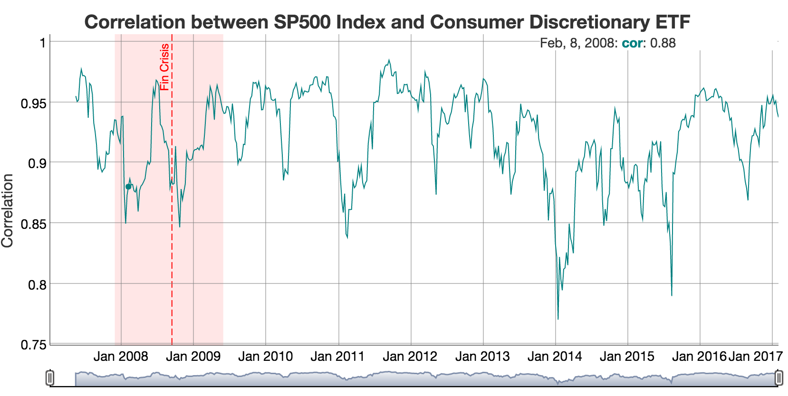

```{r setup, include=FALSE}
knitr::opts_chunk$set(echo = TRUE)
```

## Sample Shiny App

This repo contains a simple Shiny App that loads various ETFs and displays their correlation. 

The UI shows two drop boxes for:

- ETF to correlate
- Index

and a chart below with the correlation of the ETF to the Index. Example:


When the application starts, the ETFs price data is loaded. As this is an expensive operation (couple of seconds), a progress message is displayed on the UI.

To use the application, select the ETF to correlate to the (default) index SPY. The chart will be automatically updated.

It is also possible to change the index to any of the ETFs, therefore allowing to correlate one ETF against another.

## R files

In addition to the standard `server.R` and `ui.R` files, `stock_corr.R` contains global variables and utility functions used for the application. This `stock_corr.R` code is a modified version of [1].

## References

[1] Recreating RView’s ”Reproducible Finance With R: Sector Correlations, mattdancho.com, https://www.r-bloggers.com/recreating-rviews-reproducible-finance-with-r-sector-correlations/


