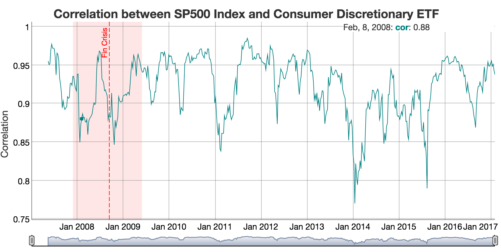

README
================
Bill Kelemen
02/05/2017

Sample Shiny App
----------------

This repo contains a simple Shiny App that loads various ETFs and displays their correlation over a 20-day rolling window. The Shiny App can be found [here](https://bkelemen.shinyapps.io/StockCorrelationShinyApp/).

As per Wikipedia, an exchange-traded fund (ETF) is an investment fund traded on stock exchanges, much like stocks. An ETF holds assets such as stocks, commodities, or bonds, and trades close to its net asset value over the course of the trading day. Most ETFs track an index, such as a stock index or bond index\[1\].

The UI shows two drop boxes for:

-   ETF to correlate
-   Index

and a chart below with the correlation of the ETF to the Index. Example: 

When the application starts, the ETF price data is loaded from Yahoo Finance. As this is an expensive operation (couple of seconds), a progress message is displayed on the UI.

To use the application, select the ETF to correlate to the (default) index SPY. The chart will be automatically updated.

It is also possible to change the index to any of the ETFs, therefore allowing to correlate one ETF against another.

R files
-------

In addition to the standard `server.R` and `ui.R` files, `stock_corr.R` contains global variables and utility functions used for the application. This `stock_corr.R` code is a modified version of ”Reproducible Finance With R: Sector Correlations"\[2\].

References
----------

\[1\] Exchange-traded fund, Wikipedia, <https://en.wikipedia.org/wiki/Exchange-traded_fund>

\[2\] Recreating RView’s ”Reproducible Finance With R: Sector Correlations", mattdancho.com, <https://www.r-bloggers.com/recreating-rviews-reproducible-finance-with-r-sector-correlations/>
